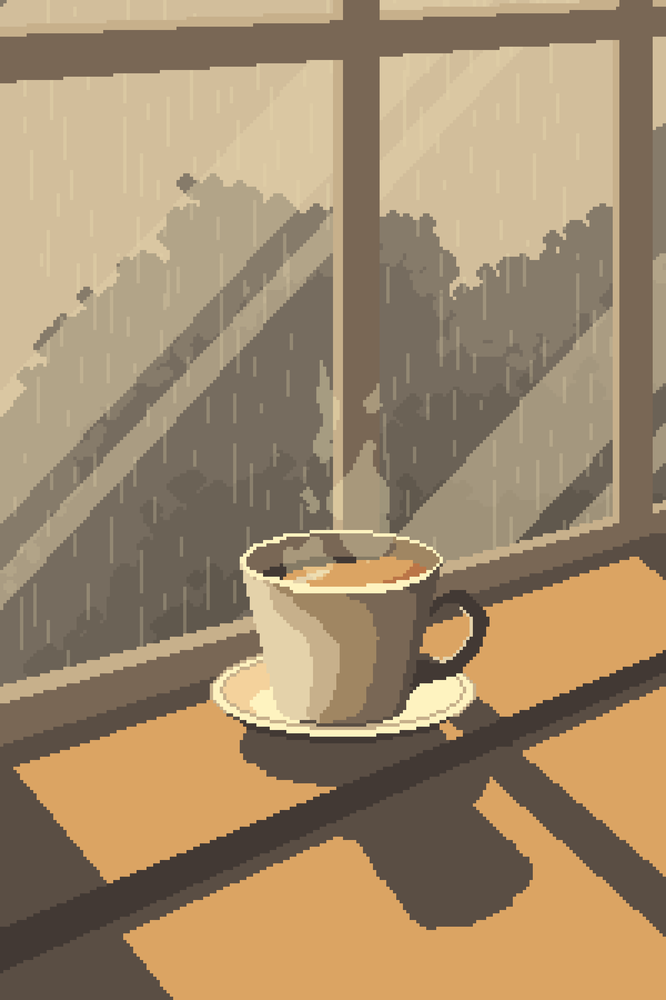

# Casal - Dashboard Responsivo 💻✨

Este projeto consiste no desenvolvimento de uma tela de dashboard (prótotipo) totalmente
responsiva, simulando um portal administrativo para a empresa **Casal**.
O objetivo é fornecer uma interface amigável, que se adapte a diferentes
dispositivos, oferecendo funcionalidades administrativas essenciais.


## Integrantes 🙋🏻‍♂️🤝🏻



| Função               | Nome              |
|----------------------|-------------------|
| Avaliador do projeto | Vitor Marcolino   |
| Candidato            | Gabriel Rodrigues |

## Funcionalidades 📊

- [x] **Gráficos Interativos:** Exibir dados relevantes em gráficos dinâmicos.
- [x] **Usuários:** Pesquisa de usuários (funcionamento de pesquisa automático pelo input).

## Estrutura do Projeto 📂

```txt
├── css
│   ├── dashboard.css
│   ├── lista_user.css
│   └── main.css
│
├── js
│   ├── dashboard.js
│   └── lista_user.js
│
├── img
│   ├── favicon.jpeg
│   ├── user-icon.png
│   ├── apexcharts-img.png (README.md)
│   └── decoracao.gif      (README.md)
│
├── utils
│   └── dados.json
│
├── dashboard.html
├── lista_user.html
├── index.html
└── README.md
```

## Instalação e Configuração ⚙

O projeto foi feito com base no Live Server do VS Code e no Github Pages,
então o projeto funcionará com base nessas duas tecnologias.

1. **Clone o Repositório:** você deverá clonar o repositório ou com git clone
ou baixando o zip através do Github.

```sh
git clone https://github.com/Rodrigues011xbx/Dashboard-Project-Casal
```

2. **VS Code:** abra o projeto no seu VS Code.

```sh
code /caminho/para/o/projeto
```

3. **Live Server:** ative o live server, caso não o tenha instale-o na parte de extensões do VS Code.